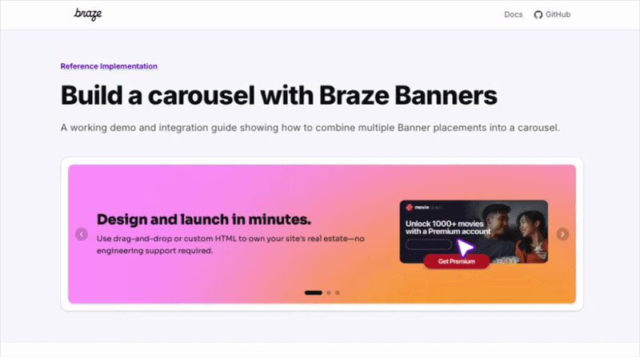

# Braze Banners Carousel Demo

A working reference implementation and developer guide for building a content carousel powered by [Braze Banners](https://www.braze.com/docs/developer_guide/banners/).

The demo page serves two purposes:

1. **Live carousel** — a working carousel driven by three Banner placements, so you can see the integration in action with real Braze content.
2. **Step-by-step integration guide** — a seven-step walkthrough structured around the core Braze SDK functions (`initialize`, `subscribeToBannersUpdates`, `insertBanner`, `requestBannersRefresh`), with a "How it works" and "Sample code" tab for each step, and links to the relevant files in this repo.



## How it works

Each carousel slide maps to its own Banner placement ID (`carousel_slot_1` through `carousel_slot_3`). The Braze SDK fetches each placement's HTML content and `insertBanner()` renders it into an isolated iframe with automatic impression tracking. Marketers get independent control over every slide's content, targeting, and scheduling — all without a code deploy.

### SDK call sequence

```
braze.initialize(apiKey, { baseUrl })        ← Initialize once; guard against double-init
braze.openSession()                          ← Start a user session
braze.subscribeToBannersUpdates(callback)    ← Fires with cached data, then on refresh
braze.requestBannersRefresh(placementIds)    ← Triggers network fetch for latest content
braze.insertBanner(banner, containerEl)      ← Renders HTML iframe, auto-logs impression
braze.removeSubscription(id)                 ← Cleanup on unmount
```

## Getting started

### Prerequisites

- Node.js 18+
- A Braze account with the Banners feature enabled ([docs](https://www.braze.com/docs/developer_guide/banners/))

### 1. Clone and install

```bash
git clone https://github.com/mark-at-braze/carousels.git
cd carousels
npm install
```

### 2. Configure environment variables

Create a `.env.local` file in the project root:

```bash
NEXT_PUBLIC_BRAZE_API_KEY=your-api-key-here
NEXT_PUBLIC_BRAZE_SDK_ENDPOINT=your-sdk-endpoint.braze.com
```

Your API key and SDK endpoint are in the Braze dashboard under **Settings → App Settings**.

> `.env.local` is gitignored — never commit credentials.

### 3. Create Banner placements in Braze

In the Braze dashboard, go to **Settings → Banner Placements** and create three placements with these exact IDs:

- `carousel_slot_1`
- `carousel_slot_2`
- `carousel_slot_3`

Then create a Banners campaign for each placement in the Braze composer. The SDK delivers the HTML verbatim; `insertBanner()` renders it in an isolated iframe.

> **Tip:** The carousel height is fixed at `256px` (set by `BANNER_HEIGHT_PX` in `lib/braze/carousel.tsx`). Design your banners at the same pixel height to avoid cropping or whitespace.

### 4. Run the dev server

```bash
npm run dev
```

Open [http://localhost:3000](http://localhost:3000). The carousel shows a loading state until banners are fetched. With `enableLogging: true` in `lib/braze/init.ts`, SDK activity is visible in the browser console.

## Project structure

```
app/
├── layout.tsx              Root layout — wraps the app with BrazeProvider
├── page.tsx                Main page: live demo, architecture tiles, integration guide
└── globals.css             Braze brand design tokens (CSS custom properties)

lib/
├── utils.ts                Tailwind merge utility (clsx + tailwind-merge)
└── braze/
    ├── index.ts            Barrel exports
    ├── init.ts             SDK initialization (guarded against double-init)
    ├── provider.tsx        React context — init, subscribe, refresh, cleanup
    └── carousel.tsx        Carousel component — reads context, calls insertBanner()

components/
├── code-block.tsx          Syntax-highlighted code display
└── step-tabs.tsx           Tabbed "How it works" / "Sample code" component

public/
└── braze-logo.png          Braze logo asset
```

## Key files

### `lib/braze/init.ts`

Initializes the Braze SDK once with `allowUserSuppliedJavascript: true` (required for Banner HTML to render inside the iframe) and `enableLogging: true` for console debug output. A module-level `initialized` flag guards against double-init in React Strict Mode.

### `lib/braze/provider.tsx`

Client component that initializes the SDK on mount, subscribes to `subscribeToBannersUpdates` for the three placement IDs, calls `requestBannersRefresh`, and exposes the banner map via React context (`BrazeContext`). Cleans up the subscription on unmount. Also exports `CAROUSEL_PLACEMENT_IDS` and the `useBrazeContext` hook.

### `lib/braze/carousel.tsx`

Reads banner data from `BrazeContext`. For each slide, calls `braze.insertBanner(banner, containerEl)` inside a `useEffect` when the slide becomes active — this renders the banner HTML into an iframe and automatically logs an impression. An `insertedSlots` ref prevents re-insertion on subsequent renders. Null banners and control-group banners render a placeholder instead.

### `app/page.tsx`

The main page. Renders the live `BannerCarousel` demo, the four architecture tiles, and a seven-step integration guide. Each step uses `StepTabs` to show a "How it works" explanation and a "Sample code" tab side by side.

### `app/layout.tsx`

Root layout using the Inter font. Wraps the app with `BrazeProvider` so banner data is available to all components.

### `components/step-tabs.tsx`

Lightweight client component that renders a Stripe-style tab bar. Used by the integration guide steps to separate explanatory prose from code samples.

## Tech stack

- [Next.js](https://nextjs.org) 16.1.6 (App Router)
- [React](https://react.dev) 19.2.4
- [@braze/web-sdk](https://www.npmjs.com/package/@braze/web-sdk) ^6.5.0
- [Tailwind CSS](https://tailwindcss.com) 4
- [TypeScript](https://www.typescriptlang.org) 5.7.3
- [lucide-react](https://lucide.dev) — chevron icons for carousel navigation
## License

MIT
